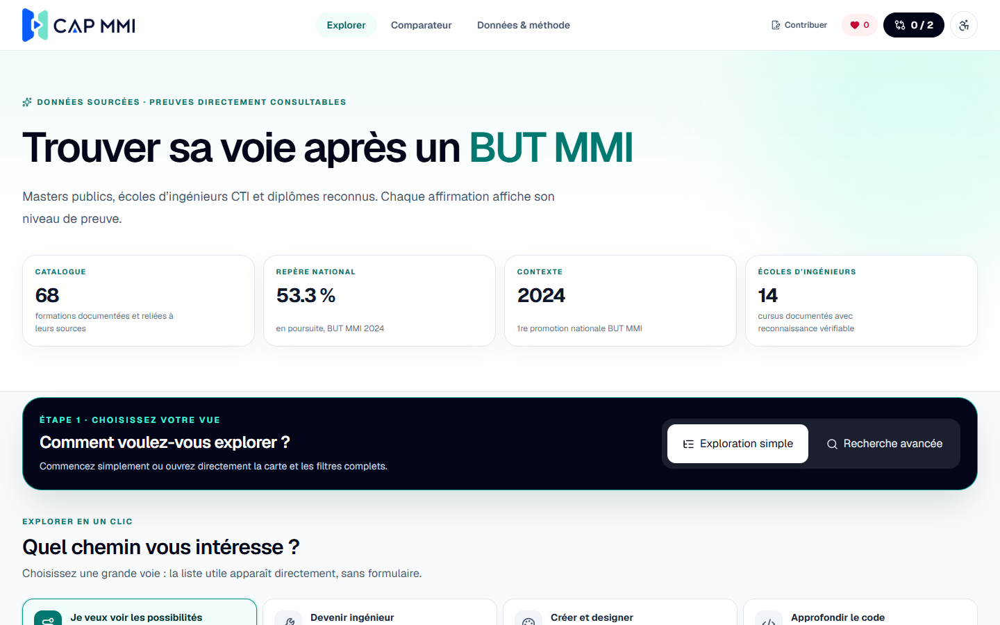
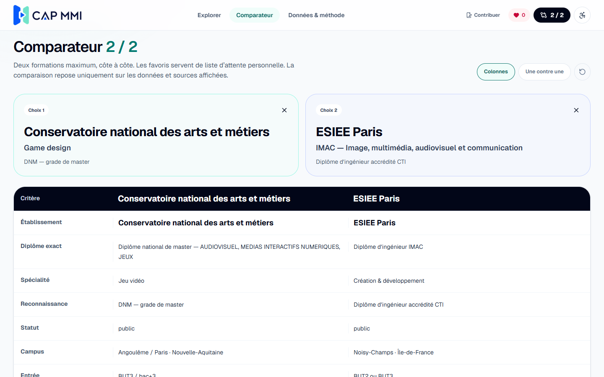
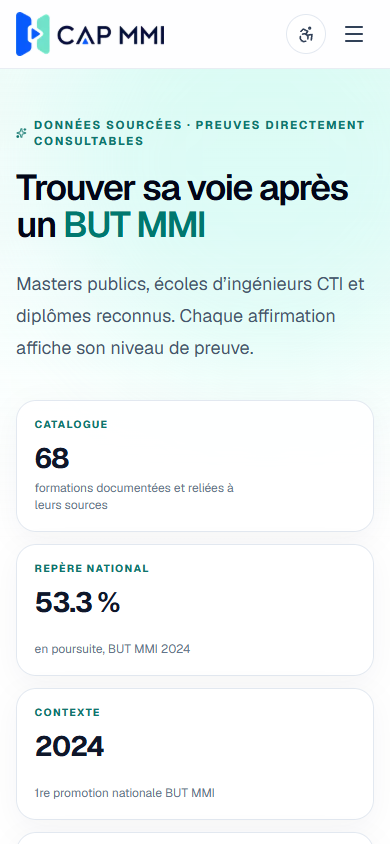
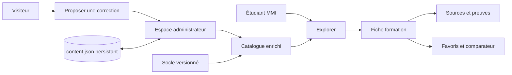

<div align="center">
  <a href="https://capmmi.mmi.place">
    
  </a>

  <h3>Trouver, vérifier et comparer les poursuites d’études après un BUT MMI</h3>

  <p>
    Un guide indépendant, gratuit et sourcé pour explorer les masters publics,<br>
    les diplômes d’ingénieur CTI et les autres formations reconnues.
  </p>

  <p>
    <a href="https://capmmi.mmi.place"><strong>🌐 Ouvrir le site</strong></a>
    ·
    <a href="#-démarrage-rapide"><strong>🚀 Installer</strong></a>
    ·
    <a href="#-contribuer"><strong>🤝 Contribuer</strong></a>
  </p>

  <p>
    
    
    
    
    
  </p>
</div>

> [!IMPORTANT]
> Cap MMI n’utilise aucune intelligence artificielle. Les informations affichées proviennent d’un catalogue préparé à l’avance, de sources reliées aux fiches et de niveaux de preuve visibles. Le site fonctionne entièrement sans clé d’API.



<table>
  <tr>
    <td width="68%">
      
    </td>
    <td width="32%">
      
    </td>
  </tr>
  <tr>
    <td align="center"><strong>Comparaison détaillée</strong></td>
    <td align="center"><strong>Interface responsive</strong></td>
  </tr>
</table>

## ✨ Cap MMI en bref

| Repère | Valeur | Ce que cela signifie |
|---|---:|---|
| Catalogue public | **68 formations** | Fiches documentées et reliées à leurs sources |
| Diplômes d’ingénieur | **14 cursus** | Reconnaissance et admission vérifiées ou explicitement à confirmer |
| Poursuite nationale | **53,3 %** | Repère public pour la première promotion BUT MMI 2024 |
| Comparaison | **2 formations** | Lecture côte à côte ou « une contre une » |
| Intelligence artificielle | **0 appel** | Aucun coût d’API et aucune analyse opaque |

> [!NOTE]
> Une formation présente dans le catalogue n’est pas automatiquement accessible à tous les profils MMI. La recevabilité, l’année d’entrée et les prérequis doivent être lus dans la fiche et confirmés auprès de l’établissement.

## 🧭 Fonctionnalités

| Explorer | Décider | Comprendre |
|---|---|---|
| Exploration simple par objectif | Favoris conservés dans le navigateur | Niveau de preuve sur chaque information sensible |
| Recherche avancée et filtres | Comparateur limité à deux choix | Sources officielles directement consultables |
| Carte de France synchronisée | Modes colonnes et une contre une | Méthode, définitions et limites documentaires |
| Fiches détaillées et repliables | Différences de coût, admission et prérequis | Parcours ouverts après les trois spécialités MMI |
| Masters, ingénieurs et autres voies | Indicateurs de sélectivité publiés | Statistiques séparées des estimations |

### Accessibilité intégrée

- navigation complète au clavier et lien d’évitement ;
- focus visible et composants HTML natifs ;
- contraste renforcé noir sur blanc ;
- fonds de lecture blanc, ivoire ou bleu pâle ;
- police OpenDyslexic activable ;
- taille du texte ajustable ;
- mode liste disponible en complément de la carte ;
- information jamais transmise uniquement par la couleur.

## 🔎 Comment lire les données ?

Chaque donnée sensible possède un **statut de preuve** et un **niveau de confiance**.

| Statut | Interprétation |
|---|---|
| ✅ **Vérifié** | Une source officielle ou la page de l’établissement confirme directement l’information |
| 🧭 **Estimation** | Des indices concordants permettent une lecture prudente, non officielle |
| ⚠️ **Contradictoire** | Les sources disponibles divergent et exigent une confirmation écrite |
| ❔ **Inconnu** | Aucune preuve suffisante n’a été trouvée ; cela ne signifie ni acceptation ni refus |

Les taux Mon Master concernant les **BUT3** ne sont jamais présentés comme des taux propres aux étudiants MMI. Les trajectoires LinkedIn servent à découvrir des parcours possibles, jamais à calculer une probabilité d’admission.

## 🏗️ Architecture



### Stack technique

| Couche | Technologie |
|---|---|
| Application | Next.js 16, App Router, React 19, TypeScript 5 |
| Interface | Tailwind CSS 4, Lucide React, OpenDyslexic |
| Validation | Zod 4 |
| Cartographie | `@svg-maps/france.departments` |
| Persistance administrable | Fichier JSON atomique sur volume Docker |
| Déploiement | Docker Compose ou Vercel pour la démonstration publique |
| Tests | ESLint, build Next.js et tests Node.js |

<details>
<summary><strong>📁 Voir l’organisation du projet</strong></summary>

```text
cap-mmi/
├── app/
│   ├── admin/                 # Connexion et tableau de bord privé
│   ├── api/                   # Santé, contributions et administration
│   ├── comparateur/           # Comparaison de deux formations
│   ├── components/            # Carte, fiches, filtres et accessibilité
│   ├── contribuer/            # Signalement et proposition publique
│   ├── lib/                   # Données, validation et sécurité
│   └── methode/               # Sources, définitions et limites
├── data/                      # Import Mon Master préparé
├── docs/screenshots/          # Captures utilisées par ce README
├── public/                    # Identité visuelle et image Open Graph
├── scripts/                   # Import et mise à jour des données
├── tests/                     # Tests de structure et de sécurité
├── compose.yaml
└── Dockerfile
```

</details>

## 🚀 Démarrage rapide

### Avec Docker — recommandé

**Prérequis :** Docker Desktop avec Docker Compose.

```bash
cp .env.example .env
```

Générez ensuite un secret de session :

```bash
node -e "console.log(require('node:crypto').randomBytes(48).toString('base64url'))"
```

Complétez `ADMIN_PASSWORD` et `ADMIN_SESSION_SECRET` dans `.env`, puis lancez :

```bash
docker compose up --build -d
docker compose ps
```

| Service | Adresse locale |
|---|---|
| Site | <http://localhost:3100> |
| Administration | <http://localhost:3100/admin> |
| État du service | <http://localhost:3100/api/health> |

> [!WARNING]
> Les modifications et propositions sont conservées dans le volume `cap_mmi_data`. La commande `docker compose down -v` supprime ce volume et ses données.

<details>
<summary><strong>Développement local avec Node.js</strong></summary>

**Prérequis :** Node.js 22.13 ou plus récent.

```bash
npm install
cp .env.example .env.local
npm run dev
```

Avec `APP_DATA_DIR=.data`, les contributions et modifications sont écrites dans `.data/content.json`, un dossier ignoré par Git.

</details>

## ⚙️ Configuration

| Variable | Obligatoire | Rôle |
|---|:---:|---|
| `ADMIN_PASSWORD` | Docker/admin | Mot de passe long et unique pour l’administration |
| `ADMIN_SESSION_SECRET` | Docker/admin | Secret aléatoire d’au moins 32 caractères |
| `APP_DATA_DIR` | Non | Dossier du fichier persistant ; `/app/data` dans Docker |
| `APP_PORT` | Non | Port exposé par Compose, `3100` par défaut |
| `NEXT_PUBLIC_SITE_URL` | Production | URL publique utilisée par les contrôles d’origine |
| `ADMIN_COOKIE_SECURE` | HTTPS | Force le cookie administrateur sécurisé |

Le fichier `.env.example` est le seul fichier d’environnement versionné. Les secrets locaux ne doivent jamais être ajoutés à Git.

## 🛡️ Administration et sécurité

Une session administrateur active permet de modifier une formation **directement depuis sa fiche**, puis de gérer les propositions dans `/admin`.

- cookie signé, `HttpOnly`, `SameSite=Strict`, limité à huit heures ;
- autorisation revérifiée dans chaque route sensible ;
- comparaison du mot de passe en temps constant ;
- contrôle d’origine sur toutes les écritures ;
- validation Zod et limites de taille ;
- limitation de débit et champ anti-robot ;
- CSP, protection anti-iframe et anti-MIME sniffing ;
- conteneur non privilégié, capacités Linux supprimées et système en lecture seule ;
- aucune proposition privée exposée par l’API publique.

> [!CAUTION]
> Vercel convient à la démonstration du catalogue, mais son système de fichiers de fonctions ne constitue pas un stockage persistant. Pour exploiter durablement les contributions et l’administration, utilisez le déploiement Docker avec un volume sauvegardé ou ajoutez un stockage externe.

## 🗂️ Données et mises à jour

- `app/lib/data.ts` contient les formations relues manuellement et leurs sources ;
- `data/masters.generated.json` contient l’import préparé depuis Mon Master ;
- `scripts/import-monmaster.mjs` reconstruit l’import à partir des données disponibles ;
- les modifications administratives sont séparées du socle Git dans `content.json` ;
- chaque fiche conserve une version, une date de vérification et un niveau de preuve.

```bash
node scripts/import-monmaster.mjs
```

## ✅ Vérifier le projet

```bash
npm run lint
npm test
docker compose config
docker compose build
```

`npm test` réalise un build de production Next.js puis exécute les tests de structure, d’accessibilité, de sécurité et de cohérence documentaire.

## 🤝 Contribuer

Deux chemins sont possibles :

1. depuis le site, utilisez **Contribuer** pour signaler une erreur ou proposer une formation ;
2. sur GitHub, ouvrez une issue ou une pull request avec la source officielle et sa date de consultation.

Une contribution documentaire utile précise idéalement :

- le nom exact du diplôme et de l’établissement ;
- le niveau d’entrée concerné, après BUT2 ou BUT3 ;
- la recevabilité explicite du BUT MMI ;
- l’URL officielle qui prouve l’information ;
- l’année académique et la date de vérification.

## 📌 Limites

- les établissements publient rarement le détail des admissions en deuxième année du cycle ingénieur ;
- aucun taux national Mon Master propre aux candidats MMI n’est disponible ;
- coûts, calendriers, capacités et modalités peuvent évoluer chaque année ;
- une trajectoire individuelle ne prouve jamais une règle générale d’admission ;
- une estimation est toujours identifiée comme telle et doit être confirmée.

## 👤 Projet

<div align="center">
  <p>
    Créé par <strong>Bastian NOEL</strong> · Première version publique · 2026
  </p>
  <p>
    <a href="https://capmmi.mmi.place">capmmi.mmi.place</a>
    ·
    <a href="mailto:bastian.noel.professionnel+capmmi@gmail.com">Demander une correction</a>
  </p>
</div>

> [!NOTE]
> Cap MMI est un outil indépendant, sans affiliation avec les IUT, universités ou écoles citées. Les données sont documentaires et peuvent évoluer. Vérifiez toujours les conditions définitives auprès de l’établissement concerné.
